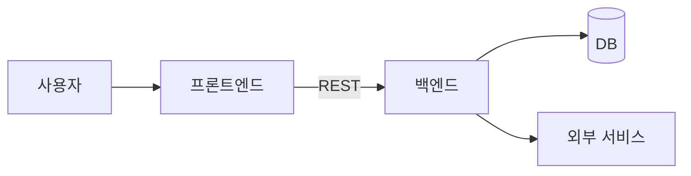

# 00. 프로젝트 개요

> 문서 상태: ❓ 작성 전
> 이 문서가 가장 먼저 작성되어야 한다. 뒤 문서들의 추천 기준이 된다.
> 대부분 📋 업무정의서에서 채운다. 업무정의서 원본 경로: `docs/PRD_<프로젝트>.md` (작성 폼: `docs/PRD_TEMPLATE.md`)

## 1. 기본 정보

### 프로젝트명 📋
- 상태: ❓ 미결정
- 결정:
- 결정일:

### 한 줄 소개 📋
- 상태: ❓ 미결정
- 결정:
- 결정일:

### 배경 / 만들려는 이유 📋
- 상태: ❓ 미결정
- 결정:
- 결정일:

## 2. 목표

### 최종 산출 목표 📋
- 상태: ❓ 미결정
- 선택지: 개인 도구 / 포트폴리오 / 목업·PoC / 의뢰 납품 / SaaS 서비스 / 사내 시스템 / 교육·발표용 데모
- 결정:
- 이유:
- 결정일:

### 성공 지표 (측정 가능한 숫자로) 📋 💬
- 상태: ❓ 미결정
- 결정:
- 결정일:

## 3. 범위

### 포함 범위 (이번에 만드는 것) 📋
- 상태: ❓ 미결정
- 결정: (업무정의서의 기능 목록 → specs 목록 표 ID와 연결)
- 결정일:

### 제외 범위 (이번에 만들지 않는 것) 📋 💬
- 상태: ❓ 미결정
- 결정:
- 결정일:

## 4. 사용자 정의

### 주 사용자 / 대상 📋
- 상태: ❓ 미결정
- 결정:
- 결정일:

### 예상 사용자 규모 (동시 접속 등) 📋 💬
- 상태: ❓ 미결정
- 결정:
- 결정일:

### 권한 등급 📋
- 상태: ❓ 미결정
- 선택지 예: 없음(내부 도구) / admin·member / admin·manager·member
- 결정:
- 결정일:

### 핵심 유저 스토리 📋
- 상태: ❓ 미결정
- 결정: ("[사용자]로서, [목적]을 위해, [행동]을 한다" 형식 3~7개. AI는 이 스토리를 기능 우선순위 판단 기준으로 쓴다)
  1.
- 결정일:

## 5. 개발 형태

### 개발 인원 / 의뢰 구조 📋
- 상태: ❓ 미결정
- 선택지: 혼자 / 협업(인원·역할) / 의뢰자-개발자 (소통 채널 기재)
- 결정:
- 결정일:

### 목표 일정 (마일스톤) 📋
- 상태: ❓ 미결정
- 결정:
- 결정일:

## 6. 시스템 구성도 (블루프린트)

> 규칙 문서(01~09) 결정 완료 후 AI가 작성하고 사용자 확인을 받는다.

- 상태: ❓ 미결정
- 결정일:

### 구성 요소 설명
| 구성 요소 | 역할 | 비고 |
|---|---|---|
|  |  |  |
