# 04. 데이터베이스 설계

> 문서 상태: ✅ 완료 (2026-08-05) — 3~4장(컬렉션 정의)은 산출물로 개발하며 갱신
> MongoDB는 스키마리스이므로 **이 문서의 컬렉션 정의가 스키마의 유일한 원본**이다. 컬렉션 추가·변경 시 같은 작업 안에서 이 문서를 갱신한다.

## 1. 기본 규칙

### DBMS / 버전
- 상태: ✅ 결정
- 결정: **MongoDB 8.x** (01_TECH_STACK.md 참조 — 2026-08-05 회의에서 PostgreSQL→MongoDB 변경, 99_DECISIONS 기록). 학원 GPU 서버의 Docker + MongoDB에 팀원 IP·패스워드 공유로 접속
- 결정일: 2026-08-05

### ORM / 데이터 접근 방식
- 상태: ✅ 결정
- 선택지 예: JPA(Hibernate) / MyBatis / Prisma / Drizzle / SQLAlchemy / 순수 SQL
- 결정: **투트랙 직접 접근** — Spring = Spring Data MongoDB(업무 컬렉션), FastAPI = Motor 비동기 드라이버(탐지·프레임 인덱스 컬렉션)
- 이유: 강사 구조(JSON 바로 저장)와 부합, 프레임 단위 저장 시 REST 오버헤드 회피. **컬렉션 소유권을 도메인별로 분리** — 업무 컬렉션은 Spring만, 탐지 컬렉션은 FastAPI만 쓰기. 다른 쪽 컬렉션은 읽기만 허용
- 결정일: 2026-08-05

### 마이그레이션 도구
- 상태: ➖ 해당 없음
- 결정: 스키마리스라 마이그레이션 도구 미사용. 컬렉션 정의는 이 문서 3~4장이 원본 — 개발하며 갱신
- 결정일: 2026-08-05

### 스키마·인덱스 소유권 (2026-08-07 변경 — 99_DECISIONS 기록)
- 상태: ✅ 결정
- 결정: **DB 스키마(컬렉션·인덱스·계정)는 CTO가 소유하고 `database/schema/` 스크립트로만 관리한다.** 애플리케이션은 데이터를 읽고 쓸 뿐 스키마를 바꾸지 않는다 (이전 결정 "각 서버 기동 시 ensure index"에서 변경)
  - `database/apply.sh` — 컬렉션·인덱스·계정을 순서대로 적용. 전부 멱등이라 재실행 안전
  - ⚠ `init/`(docker-entrypoint-initdb.d)은 **볼륨이 빈 최초 기동에만** 실행된다. 이미 떠 있는 컨테이너에는 반영되지 않으므로 스키마는 반드시 `apply.sh`로 넣는다
- 이유:
  - **unique 인덱스가 명세의 계약을 강제한다** — `(student_id,date)` 멱등 upsert·`(date,student_id,type)` 409·`event_id` 멱등. 코드에만 맡기면 "멱등하다고 믿는데 실은 아닌" 상태가 조용히 지나간다. 게다가 **중복 데이터가 쌓인 뒤에는 unique 인덱스 생성이 실패**하므로 개발 초기에 걸어야 한다
  - **TTL 인덱스가 개인정보 자동 삭제의 백스톱이다** — 하나라도 누락되면 개인정보가 남는다. 도메인별 구현에 분산시킬 위험이 크다
- **누락 감지 (2026-08-13 추가)**: 앱이 스키마를 만들지 않는다는 건 곧 **`apply.sh`를 빼먹어도 앱은 아무 이상 없이 뜬다**는 뜻이다. 조회도 저장도 되고 헬스체크도 초록불이라 실패 신호가 어디에도 없다. 그래서 `ai` 기동 시 TTL 인덱스 존재만 확인한다 (`webapp/app/services/db_health.py`)
  - 대상 9개 — `daily_courses`·`daily_roster`·`attendance_history`·`attendance_exceptions`·`detection_alerts`·`notifications`·`detection_events`·`registered_faces`·`detection_records`. `daily_stats`(익명 통계)·`batch_runs`(실행 이력)는 TTL이 없는 게 정상이다
  - **확인만 하고 만들지 않는다** — 스키마 소유권은 그대로 CTO다. 빠졌으면 ERROR 로그에 `apply.sh` 안내가 함께 나간다
  - **기동은 막지 않는다** — 개인정보가 늦게 지워지는 것보다 퇴실 감시가 통째로 서는 쪽이 당장의 피해가 크다. `apply.sh`는 나중에 돌려도 소급 적용된다(만료 시각은 문서에 이미 들어 있다)
  - ⚠ 목록은 `database/schema/02_indexes.js`와 **같이 유지해야 한다.** 어긋나면 새 TTL 컬렉션이 조용히 확인 대상에서 빠지므로, 테스트(`test_db_health.py`)가 두 곳을 대조한다
- 결정일: 2026-08-07 / 2026-08-13(누락 감지 추가)

### 애플리케이션 계정 권한
- 상태: ✅ 결정
- 결정: **3층 분리** (`database/schema/03_roles.js`) — 핵심은 **사람 계정과 앱 계정을 섞지 않는 것**
  | 계층 | 계정 | 보유 | 권한 |
  |---|---|---|---|
  | 관리(사람) | `admin_*` | **CTO·PM 각자 개인 계정** | `root` — 스키마 적용·계정 관리 |
  | 앱(프로그램) | `autogt` | Spring·FastAPI (`.env` 공유) | **커스텀 롤 `appDataWrite`** — 화이트리스트 9개 컬렉션의 데이터 CRUD만. 컬렉션·인덱스 생성/삭제 불가 |
  | 조회(사람) | `view_*` | **팀원 개인 계정** (mongosh·Compass) | **읽기 전용** — 실수로 지울 수 없다 |
  - **앱 계정을 사람에게 주지 않는다**: 팀원 개인 계정으로 Spring을 돌리면 `.env`가 사람마다 갈리고, 계정을 회수하는 순간 앱이 멈춘다. 앱이 쓰는 계정은 프로그램의 것이다
  - **root를 공유하지 않는다**: 한 계정을 두 사람이 쓰면 유출 시 통째로 교체해야 하고 행위 구분도 안 된다. CTO·PM 각자 계정으로 둔다
  - 계정 목록·비밀번호는 `database/.accounts.json`(**gitignore, CTO 로컬 전용**)에 두고 `apply.sh`가 읽어 생성한다. 템플릿은 `.accounts.example.json`, 비밀번호는 개인 DM으로만 전달
  - ⚠ **로컬 Docker에서는 이 권한 체계가 실효가 없다** — 각자 컨테이너의 root를 본인이 갖고 있다. 실질적 통제는 **GPU 서버 공용 DB**에서 발생하며, 지금 스크립트를 갖춰두는 것은 서버가 열리는 즉시 적용하기 위함이다
  - ⚠ MongoDB Community에는 **감사 로그가 없다** — 개인 계정을 나눠도 "누가 무엇을 조회했나"는 추적되지 않는다. 개인 계정의 실익은 추적이 아니라 **접근 회수와 사고 시 범위 축소**다
- ⚠ 구현 주의 (2026-08-07 실측):
  - MongoDB 기본 `readWrite` 롤은 `createIndex`·`dropIndex`·`dropCollection`을 **포함**한다 — 그대로 쓰면 앱이 스키마를 바꿀 수 있다
  - **DB 전체 범위(`{collection:''}`)에 `insert`를 주면 컬렉션 생성까지 허용된다.** 그래서 CRUD 권한은 반드시 **컬렉션 단위로 열거**한다. 부수 효과로 오타난 컬렉션명에 쓰면 조용히 새 컬렉션이 생기는 대신 즉시 거부된다
  - 앱이 컬렉션을 자동 생성할 수 없으므로 **컬렉션은 `01_collections.js`가 미리 만든다**
  - 통합 테스트 DB(`project3_test`)는 예외로 `readWrite` 유지 — 테스트는 컬렉션 생성·삭제가 일상이다 (rules/07)
- 결정일: 2026-08-07

## 2. 네이밍 및 공통 규칙

### 네이밍 규칙
- 상태: ✅ 결정
- 결정: 컬렉션 snake_case 복수형(예: `detection_events`), 필드 snake_case
  - 예외: `daily_roster`는 `roster`(명단) 자체가 집합을 뜻하는 단어라 단수형을 유지한다 (`daily_rosters`는 "명단들"이 되어 의미가 어색). 2026-08-07 확인
- 결정일: 2026-08-05

### 공통 필드
- 상태: ✅ 결정
- 결정: 전 컬렉션 `created_at`, `updated_at`. 개인정보 포함 컬렉션은 `expire_at`(TTL 인덱스용) 추가
- 결정일: 2026-08-05

### ID 전략
- 상태: ✅ 결정
- 선택지: ObjectId / UUID / ULID
- 결정: MongoDB 기본 **ObjectId** (`_id`)
- 이유: 내부 시스템이라 충분, 별도 라이브러리 불필요
- 결정일: 2026-08-05

### 트랜잭션 / 동시성 방침
- 상태: ✅ 결정
- 결정: 단일 문서 원자성 기본 (멀티 문서 트랜잭션은 필요 시에만). 동시 쓰기 경합 없는 규모. 오후 6시 일괄 퇴실 트래픽은 미해결 과제로 검토 예정(8/5 회의)
- 결정일: 2026-08-05

### 개인정보 라이프사이클 (핵심 정책 — 2026-08-05 회의 + 인터뷰 확정)
- 상태: ✅ 결정
- 결정:
  - **수집**: LMS DB 직접 접근 금지 — LMS 출결 API를 그때그때 조회하되, **응답 전체를 저장하지 않고 당일 입실자만 걸러 저장**한다 (LMS는 미출석자를 포함한 전원을 주므로 거르는 책임은 우리에게 있다). 연락처(`phone`)는 아래 "연락처 취급" 참조
    - **저장 최소화 2원칙 (2026-08-07 CTO 확정 — LMS 실스펙 확인 후 명문화)**:
      ① **행 최소화** — LMS 응답은 미출석자를 포함한 당일 수강생 전원을 주지만, `daily_roster`에는 **`checkInTime`이 있는 입실자만** 저장한다. 미출석자는 우리 DB에 남기지 않는다 (BAT-002는 LMS 응답에서 그 시점 계산해 알림만 발송 — specs/12)
      ② **열(필드) 최소화** — 응답 필드는 **화이트리스트 방식**으로 우리가 쓰는 것만 취한다. `birth`(생년월일)·`type`(고용형태)·`status`·`checkOutTime` 등은 읽지도 저장하지도 않는다 (매핑표: specs/12 BAT-001)
    - 미출석자 관련 데이터가 우리 DB에 남는 경우는 두 가지뿐: 익명 집계(`daily_stats.absent_count`)와, 행정실이 병결 등 예외를 등록한 소수(`attendance_exceptions` — 이름 스냅샷, TTL 익일)
  - **연락처(`phone`) 취급 (2026-08-07 LMS 담당자 확인)**: LMS 응답에 연락처가 없다. **개발 단계에서는 팀원 연락처를 테스트 수신처로 쓰고, 시스템이 완성되면 LMS가 API 응답에 학생 연락처를 추가해 준다.**
    - 그때까지 `daily_roster.phone`은 **항상 null**이다 — 실제 학생 연락처를 우리가 따로 수집하지 않는다. 통과 경로는 선배선돼 있어(2026-08-09) LMS가 스냅샷에 싣는 순간 코드 수정 없이 흐른다. 저장돼도 명단과 같은 라이프사이클(퇴실 즉시 삭제 + TTL)을 탄다
    - 팀원 연락처도 개인정보다: `.env`(`SMS_TEST_RECIPIENT`)로만 관리하고 커밋 금지, 프로젝트 종료 시 제거
    - ⚠ **실 연락처가 들어오는 순간 자동으로 실제 학생에게 문자가 나가면 안 된다** — 발송은 `SMS_MODE` 스위치로만 전환한다 (rules/05 안전장치)
  - **삭제**: **퇴실 시 즉각 삭제**(애플리케이션 로직) + `expire_at` **TTL 인덱스를 백스톱**으로 이중화 — 삭제 로직이 누락돼도 하루 안에 자동 소멸
  - **보관**: 익명 통계(일별 미출결 건수 등 개인 식별 불가 데이터)·시스템 로그는 보관 — 개인정보 아님. 최종발표 데모용 누적 데이터로 활용
- 결정일: 2026-08-05

### 개인정보 보존기간 = LMS `period` (2026-08-11 팀회의 확정)
- 상태: ✅ 결정 (형식 파싱은 실 LMS 연결 시 확정)
- 결정: **개인정보 보존기간을 LMS API `period`(과정 시작~종료일)에 묶는다** — 동의서 기한과 일치시킨다.
  - **⚠ 적용 범위 확대 (2026-08-12) — 개인정보 문서 전부가 과정 기간 동안 산다.** 08-11 시점엔 `registered_faces`·탐지 기록만 대상이었으나, "기간 안이면 언제든 검색되고 기간이 끝나면 다음날 사라진다"로 정리됐다(CTO 확정). 다음주 검색 화면·LLM 도구가 볼 데이터가 24시간 TTL이면 **어제 것부터 이미 없다**는 것이 전환 이유다
    | 컬렉션 | 이전 | 지금 |
    |---|---|---|
    | `daily_courses` | TTL 익일 | **period 종료일 +1일** |
    | `attendance_history` | — | **신설** (아래) |
    | `attendance_exceptions` | TTL 익일 | **period 종료일 +1일** |
    | `detection_events` | TTL 24h | **period 종료일 +1일** |
    | `detection_alerts` | TTL 24h | **period 종료일 +1일** |
    | `notifications` | TTL 24h | **period 종료일 +1일** |
    | `detection_records` | period (08-11) | 그대로 |
    | `registered_faces` | period (미구현) | **✅ 구현 (2026-08-12)** — 아래 "등록 임베딩" 참조 |
    | `daily_roster` | 퇴실 즉시 삭제 + TTL 익일 | **그대로 유지** (아래 이유) |
  - **`daily_roster`만 당일 작업 테이블로 남긴다.** 이 컬렉션의 삭제는 저장 관리가 아니라 **판정 그 자체**이고, 동시에 세 가지를 하고 있다: ① 잔존 판정("있다=미퇴실") ② 퇴실 알림 중복 방지(LMS 스냅샷은 퇴실자를 하루 종일 알려주므로 "이번에 실제로 지워진 사람"만 발행) ③ 탐지 기록 게이트(`roster is None`이면 사진을 남기지 않는다). **누적으로 바꾸면 ③이 조용히 뚫려 지나가는 전원이 사진과 함께 저장된다** — 08-11에 폐기한 "경찰 관제 로그식 전량 저장"이 되살아난다. 그래서 명단은 그대로 두고, 지워지는 값을 `attendance_history`로 옮긴다
  - **`attendance_history` 신설** — 퇴실이 확정된 출결 이력. BAT-001이 명단에서 지우면서 append한다(`(date, student_id)` 멱등 upsert). **연락처는 옮기지 않는다** — `phone`은 명단과 함께 사라지는 값이라 이력에 실으면 그것만 과정 내내 남는다. 이력 저장 실패는 흡수한다(판정이 이력보다 우선 — 실패로 퇴실 처리를 막으면 그날 나머지 학생까지 멈춘다)
  - **구현 (2026-08-12)**: 보존기간 해석은 attendance가 소유한다 — `ResolveRetentionUseCase.expireAtFor(date, courseId)`. detection·notification은 각자의 `RetentionPort`로 묻고 `daily_courses`를 직접 읽지 않는다. webapp(FastAPI)은 같은 규칙을 `detection.resolve_expire_at()`으로 따로 구현한다(서비스가 달라 코드를 공유하지 않는다)
    - `courseId`를 모르는 문맥(미매칭 이벤트·이미 퇴실해 명단에서 빠진 학생·발송 이력)은 **그날 강의 중 가장 이른 종료일**을 쓴다. 길게 잡으면 짧은 과정 수강생의 데이터가 동의 범위 밖에 남고, 짧게 잡으면 잃는 것이 조회 편의뿐이라 **짧은 쪽으로 실패**한다
    - 과정 종료일을 못 찾으면 **당일(24h)로 후퇴**한다. ⚠ 안전한 방향이지만 **기능은 조용히 죽는다** — 검색이 하루치밖에 못 보게 되므로, `period_end_date` 파싱 실패 WARN이 계속 찍히는지 확인할 것
    - **`expire_at`은 기록 시점에 박히므로 주기적으로 다시 맞춘다** (✅ 2026-08-12 구현). 실 LMS 연결에서 **2027-02-11까지 가는 6개월 과정**이 확인돼(과정 9개 중 3개가 5개월 이상), 기간 중 시간표 변경은 일어난다고 보고 스윕을 넣었다
      - 실측으로 재현한 구멍: 과정을 09-07 → 08-24로 줄여도 기존 문서 5종이 전부 09-07을 유지했다. **단축**되면 데이터가 동의 범위 밖까지 남고 **연장**되면 검색에 구멍이 난다
      - **쓰기와 같은 규칙으로 다시 계산한다**(A안) — 규칙을 두 벌 두면 스윕이 돌 때마다 값이 왔다 갔다 한다. 정밀도는 문서가 가진 정보만큼이다: `attendance_history`만 `course_id`가 있어 **강의별**, 나머지는 **날짜별**(그날 가장 이른 종료일)
      - **각 도메인이 자기 컬렉션만 갱신한다** (rules/04 소유권). attendance가 `RetentionRecomputedEvent`를 발행하고 detection·notification이 받아서 자기 것을 고친다 — attendance가 남의 컬렉션을 직접 쓰지 않는다
      - 주기: Spring `attendance.retention-sweep.cron`(기본 매일 04:10) / FastAPI는 기존 정리 루프에 얹었다(**만료 재계산 → 파기 순서** — 연장됐는데 옛 날짜로 지워지면 안 된다)
      - 멱등하다 — 값이 이미 맞으면 아무 문서도 건드리지 않는다. 로그의 갱신 건수가 곧 "실제로 바뀐 것"이다
  - **등록 임베딩(`registered_faces`)은 "날짜"가 아니라 "과정"에 묶인다** (✅ 2026-08-12 구현). 탐지 기록은 기록된 날짜 기준이지만, 등록은 그 학생이 듣는 **과정이 끝날 때까지** 유효해야 한다
    - 등록 시(`tools/register_faces.py`·SCR-004): 학생의 `course_id`를 오늘 명단 → **과정명**(화면이 LMS 명단에서 받아 보낸다) → 누적 이력(최근) 순으로 찾고, 그 강의의 **가장 최근** `daily_courses` 문서에서 종료일을 읽는다(시간표 변경은 최신 문서에 먼저 반영된다). 문서에 `course_id`를 저장해 두므로 스윕이 강의별로 정확히 맞출 수 있다 — 신설 컬렉션이라 B안식 정밀도를 처음부터 가져갔다
    - 과정을 못 찾으면 등록은 **24h 폴백**(짧은 쪽), 서버 일일 스윕이 강의 정보가 생기는 즉시 늘린다
    - ⚠ **과정명을 보는 단계가 왜 생겼나** (2026-08-12 실측): `daily_roster`는 퇴실 즉시 지워지므로 저녁 등록에서는 명단이 비어 있다. 그러면 만료가 "그날 전체 강의 중 가장 이른 종료일"로 떨어져 **과정이 내년까지인 학생의 얼굴이 이틀 뒤 파기될 상황**이 실제로 나왔다. 과정명은 오늘 LMS 스냅샷의 값이라 이력보다 앞에 둔다
    - **동의 철회·오등록·중도 퇴원은 보존기간을 기다리지 않는다** — 화면(SCR-004 등록됨 탭)에서 즉시 삭제한다(API-018). 삭제는 등록부 리로드까지 하므로 다음 탐지부터 그 사람은 식별되지 않는다. 되돌릴 수 없다(재촬영이 유일한 복구)
    - ⚠ **삭제는 임베딩과 보관 사진을 함께 지운다** (2026-08-13 수정). 08-12에 사진 보관 옵션이 들어왔는데 삭제 경로만 예전 가정("사진을 남기지 않는다")에 멈춰 있어, **동의 철회를 해도 얼굴 사진 원본이 디스크에 남았다**. 임베딩만 지우면 조회에서 안 잡히니 고쳐진 것처럼 보이는 게 특히 나쁘다 — 파기 요구에 대해서는 임베딩보다 사진이 더 직접적인 개인정보다
    - ⚠ **만료(TTL)로 문서가 지워질 때는 사진이 아직 남는다** — 탐지 사진은 정리 루프(`DetectionRecorder.cleanup_expired`)가 파일까지 지우지만 등록 사진에는 그 짝이 없다. 등록은 탐지와 독립이라(카메라 0대·`DETECTION_ENABLED=false`여도 등록은 돈다) 탐지 루프에 얹으면 "탐지 꺼짐 = 사진 영구 잔존"이 된다 → 독립 정리 루프 필요, 이슈로 분리
    - 스윕(`registry.refresh_registration_retention`, detection 정리 루프에 편입): ⚠ **해석 불가 문서는 건드리지 않는다** — 등록 때와 폴백이 다른 이유는, 스윕이 일시적 데이터 공백 때문에 멀쩡한 만료를 24시간으로 줄이면 **다음날 등록부가 통째로 증발**하기 때문
    - 등록 **사진 파일**은 화면에서 선택했을 때만 저장한다(SCR-004 "사진도 함께 보관", 2026-08-12). 저장 위치는 `ENROLL_PHOTO_DIR`, 구조는 `<이름=학번>/<방향>_<n>.jpg`
  - **앙상블 갤러리 — 임베딩을 모델별로 나눠 담는다** (✅ 2026-08-13 구현, 같은 날 **원트랙**으로 확정)
    | 필드 | 모델 | 누가 채우나 |
    |---|---|---|
    | `arcface_embeddings` / `adaface_embeddings` + `ensemble` | ArcFace-R100 / AdaFace-ir101 각 512d | 화면 등록이 **실시간**으로 (`tools/backfill_ensemble_gallery.py`는 모델 교체 시 재생성용) |
    | ~~`embeddings` + `model`~~ | ~~SFace 128d~~ | **폐기** — 2026-08-13 원트랙 전환으로 더 이상 쓰지도 읽지도 않는다 |
    - **왜 한 배열에 섞지 않나**: 모델이 다르면 임베딩 공간이 달라 유사도가 무의미해진다. 512차원끼리는 모양이 맞아 **조용히** 섞이므로 필드를 아예 나눈다. 문서 하나에 공존시키는 이유는 만료(`expire_at`)·과정(`course_id`)이 사람 단위라서다 — 갤러리를 따로 두면 파기 규칙이 두 벌이 된다
    - ⚠ **두 필드는 같은 장수·같은 순서여야 한다.** 같은 사진에서 나온 짝이라 어긋나면 장수는 맞는데 다른 장의 두 얼굴이 한 장으로 묶인다. 추가 촬영 병합이 두 필드에 **같은 인덱스**를 적용하는 이유다(`enroll._merge_ensemble`). 장수가 다른 문서는 등록부가 아예 싣지 않는다
    - ⚠ **모델을 바꿔도 사람을 다시 부르지 않는다** — 보관 사진이 등록 세션의 원본이므로 백필만 다시 돌리면 된다. `ensemble.arcface`/`adaface`에 만든 모델 파일명을 남기는 이유가 이것이다(안 맞는 문서만 골라 재생성). 탐지 상태 화면의 `backend`와 대조할 값이기도 하다
    - ⚠⚠ **그 파일명은 반드시 "적재기가 실제로 연 파일"에서 가져온다** (`ArcFaceR100.model_name`·`AdaFaceIR101.model_name`). 상수를 따로 적으면 어긋나고, **어긋나는 순간 추가 촬영이 기존 임베딩을 통째로 버린다** — `_merge_ensemble`이 "모델이 다르면 잇지 않는다"고 판단하기 때문이다(그 판단 자체는 옳다).
      - **2026-08-14에 실제로 났다**: 백필 도구가 `ADAFACE_FILE`(학습용 `.pt`)을 라벨로 적었는데 어댑터는 ONNX만 받으므로(#88) 그 이름은 **처음부터 거짓**이었다. 추가 촬영한 1명의 세션1 임베딩 30장이 버려졌다(사진이 남아 있어 복구). 병합 로직 테스트는 전부 통과했다 — 틀린 건 로직이 아니라 **입력값**이었고, 그 입력을 만드는 도구엔 테스트가 없었다
      - 회귀 방지: `tests/test_gallery_model_label.py`가 ① 어댑터가 실제 파일명을 알려주는지 ② 갤러리 도구가 `.pt` 상수를 참조하지 않는지 본다
    - ⚠ **앙상블 임베딩이 없는 문서는 등록부에서 빠지고 WARN을 남긴다.** 조용히 빠지면 그 사람만 식별되지 않는데, 오식별과 달리 아무 흔적이 없어 훨씬 찾기 어렵다
    - 실측(2026-08-13, 등록자 11명·보관 사진 330장 — 05_AI 5차): **앙상블 98.9% / SFace 93.2%**, 미등록자 264장 개방집합에서 **오통과 0.0%**. 상세와 임계값(0.40) 근거는 05_AI 참조
  - **동의서는 5년, 우리는 과정 기간 (2026-08-12 확인)**: 동의서상 보존 한도는 **수업 종료일 기준 5년**이다. period(2~6개월)는 그 안쪽이라 **동의 범위를 넘지 않는다**. 그런데도 5년까지 끌지 않는 이유 — 얼굴 임베딩·사진은 **생체정보**라 목적(출결 판정)이 끝나면 파기가 원칙이고, 동의를 받았다는 사실이 최소보관 원칙을 면제해 주지 않는다. 5년 보존이 필요한 것은 **법정 출결 서류**이고 그것은 LMS가 보유한다 — 우리는 보조 시스템이라 그 책임을 지지 않는다
  - 이전 적용 대상(2026-08-11 시점): `registered_faces`(얼굴 등록 임베딩·사진), 탐지 기록(사진 포함, 검색/알리바이 기능용)
  - 구현: BAT-001이 강의 `period` 종료일을 **`daily_courses.period_end_date`에 저장**(✅ 2026-08-11 구현 — 형식 `"2026-07-13~2026-09-07 (10회차)"`, 실패 시 null+WARN) → 보존기간 소비자(registered_faces·탐지 기록)가 이 날짜를 자기 문서 `expire_at`으로 삼는다 → **기존 TTL 인덱스가 그 날짜에 자동 삭제**. 우리가 날짜를 계산·관리하지 않고 LMS 값을 그대로 만료 시각으로 쓴다. 소비자 연결: 탐지 기록(`detection_records`) ✅ 2026-08-11 구현 / 등록 갤러리(`registered_faces`)는 ① 구현 시
  - ⚠ **TTL 인덱스는 문서만 지운다** — 사진 파일은 webapp의 일일 정리 루프가 만료 문서의 파일을 삭제하고, 문서를 잃은 고아 파일도 회수한다. DB만 TTL 걸고 끝내면 사진이 로컬에 영구 잔존하는 사고가 된다. **컬렉션마다 별도 루프**다 — 탐지 기록은 `DetectionRecorder.cleanup_expired`(DETECTION_ENABLED=true일 때만, 탐지 파이프라인 수명에 종속), 등록 보관 사진은 `registry.cleanup_expired_enroll_photos`(2026-08-13 구현, 이슈 #96 — lifespan 독립 태스크로 카메라·탐지 설정과 무관하게 항상 돈다)가 담당한다. 등록은 탐지와 독립 기능이라 탐지 루프에 얹으면 "탐지 꺼짐 = 등록 사진 영구 잔존"이 되기 때문에 분리했다
  - `daily_roster`는 **당일 전이 데이터로 유지**(퇴실 즉시 삭제 + 익일 TTL) — period는 바깥 상한일 뿐. 나머지는 위 표대로 period를 따른다
  - ⚠ **"경찰 관제 로그식 전량 저장" 폐기** (2026-08-11) — 지나가는 전원을 저장하지 않는다. 우리 주제 범위(미퇴실 대상)만. 데이터 과중·개인정보 부담 회피 (99 참조)
  - ⚠⚠ **유일한 예외 — `detection_candidates` (2026-08-14 2단계 분리, 99 참조).** 탐지와 인식을 DB로 끊으면 **"누구인지 모르는 상태의 얼굴"이 반드시 한 번 DB를 거친다.** 위 폐기 결정과 같은 방향이라 정면으로 부딪히므로, 이 컬렉션은 **기록이 아니라 작업 큐**라는 것을 구조로 강제한다:
    - **학번을 담지 않는다** — 적재 시점에 매칭이 없다. 문서만 봐서는 누구인지 알 수 없다
    - **이미지는 문서 안 바이너리로만 든다** — 디스크에 파일을 만들지 않는다. 파일이 없으면 고아 파일도, 문서와 따로 도는 정리 루프도 없다(탐지 사진·등록 사진이 각각 별도 루프를 갖게 된 이유가 이것이다). 문서가 죽으면 이미지도 같이 죽는다
    - **처리 즉시 삭제가 정상 경로**다. TTL(분 단위, 기본 15분)은 워커가 죽었을 때의 백스톱일 뿐이고, 큐에 오래 남아 있는 것 자체가 장애 신호다
    - **디스크에 사진이 남는 조건은 그대로다** — 미퇴실 대상으로 판정된 뒤에만 `detection_records`에 쓴다. 2단계 분리는 그 게이트를 옮기지 않는다
    - ⚠ 큐 상한(`DETECTION_CANDIDATE_QUEUE_MAX`)을 반드시 둔다. 워커가 밀리는데 탐지만 계속 적재하면 "잠깐 머무는 큐"라는 전제가 무너져 **미처리 얼굴이 무한히 쌓인 저장소**가 된다 — 그 순간 위의 모든 근거가 사라진다
  - ⚠ `period` 형식(문자열 범위 vs 시작·종료 분리)은 08-07 실응답에서 "안 읽는 필드"였다 → 실 LMS 연결 시 대조 후 파싱 (specs/12)

---

## 3. 컬렉션 구조도 (산출물 — 개발하며 갱신)

> 컬렉션 추가/변경 시 이 다이어그램을 같은 작업 안에서 갱신한다. (참조 관계는 앱 레벨 — MongoDB에 FK 없음)

```mermaid
%% 설계 초안 v4 (2026-08-07 — LMS 실스펙 정합화: 필드명 통일·누락 필드 추가·daily_courses 신설)
%% 수집 원칙: daily_roster는 입실자만(check_in_time 존재) 저장 — 미출석자는 저장하지 않는다 (1장 개인정보 라이프사이클)
erDiagram
  daily_courses ||--o{ daily_roster : "강의별 명단 (course_id, date)"
  daily_roster ||--o{ detection_events : "미퇴실자 식별 대조 (student_id)"
  daily_roster ||--o{ notifications : "미퇴실 문자 발송 (student_id)"
  daily_roster ||--o{ attendance_exceptions : "당일 예외 (student_id)"
  registered_faces ||--o{ detection_events : "임베딩 매칭 (student_id)"
  detection_candidates ||--o| detection_events : "인식 워커가 꺼내 판정한 결과 (2단계 분리)"
  detection_events ||--o| detection_alerts : "수신·판정 결과 (event_id)"
  daily_roster ||--o{ detection_alerts : "잔존 대조 (student_id)"
  daily_roster ||--o{ detection_records : "잔존 확인 후에만 기록 (student_id)"
  daily_courses ||--o{ detection_records : "period_end_date → expire_at"
  detection_events ||--o| detection_records : "원본 이벤트 (event_id)"
  daily_roster }o--|| daily_stats : "익명 집계"
  daily_roster ||--o| attendance_history : "퇴실 시 이력으로 이관 (phone 제외)"
  daily_courses ||--o{ attendance_history : "period_end_date → expire_at"

  attendance_history {
    ObjectId _id PK
    string date "YYYY-MM-DD - (date, student_id) unique 멱등 키"
    string student_id
    string student_name "PII"
    string course_id
    string course_name
    date check_in_time "명단에서 그대로 옮긴 입실 시각"
    date checked_out_at "우리가 퇴실을 확인한 시각 - LMS 태그 시각이 아니라 명단에서 지운 시점"
    date expire_at "TTL - period 종료일 다음날. phone은 옮기지 않는다"
  }
  daily_roster {
    ObjectId _id PK
    string date "YYYY-MM-DD - (student_id, date) unique 멱등 키 (specs/12 BAT-001)"
    string student_id "LMS trneeCstmrId 12자리 - 시스템 공통 키 (specs/12 실스펙)"
    string student_name "PII"
    string phone "PII nullable - 개발 중에는 항상 null (LMS가 완성 후 응답에 추가 예정, 2026-08-07 확인)"
    string course_id "LMS tracseId"
    string course_name "LMS courseName - SCR-001 강의명 컬럼·칩"
    date check_in_time "입실 시각 - 입실자만 저장하므로 항상 non-null"
    date expire_at "TTL - 퇴실 즉시 삭제 백스톱"
  }
  daily_courses {
    ObjectId _id PK
    string date "YYYY-MM-DD - (course_id, date) unique"
    string course_id "LMS tracseId"
    string course_name "LMS courseName"
    int capacity "LMS total - 정원 (SCR-001 칩 분모)"
    int checked_in_count "당일 누적 입실 수 - 퇴실해도 유지 (roster에서 세면 퇴실자가 빠진다)"
    string class_start_time "HH:mm - LMS time 파싱 결과 T_in"
    string class_end_time "HH:mm - LMS time 파싱 결과 T_out - 퇴실 창·BAT-003 기준"
    bool class_day "LMS classDay - 오늘 수업일 여부. false면 퇴실 창에서 제외 (공휴일·휴강)"
    string period_end_date "ISO yyyy-MM-dd - LMS period 종료일. 보존기간 근거 (2026-08-11), 실패 시 null"
    date expire_at "TTL 익일 - 개인정보 아님, 정리 목적"
  }
  detection_candidates {
    string _id PK "uuid - 탐지 단계가 발급"
    string camera_id
    string detected_at "ISO KST - 탐지 시각 (인식이 늦어도 이 값이 사건 시각이다)"
    array bbox
    double det_score
    binary aligned "112x112 정렬 얼굴 PNG - 임베딩 입력. 무손실이어야 인라인 경로와 임베딩이 같다"
    binary crop "bbox 2.5배 확장 크롭 JPEG - 미퇴실 확정 시에만 detection_records로 나간다"
    string status "pending / processing"
    int attempts "인식 실패 재시도 횟수 - 상한 초과 시 폐기"
    date claimed_at "nullable - 워커가 집은 시각. 오래되면 스톨로 보고 pending 복귀"
    date created_at "적재 시각 - 처리 순서(FIFO) 키"
    bool roi_out "📝 설계 - 탐지 위치가 카메라 ROI 밖인가 (C-2 가). claim 정렬의 1순위 키. 참=밖인 이유는 rules/05 참조 - 오름차순에서 필드 없는 구버전 문서가 맨 앞에 와야 굶지 않는다"
    date expire_at "TTL 분 단위(기본 15분) - 학번 없음. 작업 큐라 처리 즉시 삭제가 정상 경로"
  }
  detection_events {
    ObjectId _id PK
    string camera_id "cam_12f_1 / cam_12f_2 / cam_1f"
    date detected_at
    string matched_student_id "매칭 실패 시 null"
    double similarity
    array bbox
    date expire_at "TTL"
  }
  detection_records {
    ObjectId _id PK
    string student_id "미퇴실 대상만 - roster 잔존 확인 후 기록"
    string date "YYYY-MM-DD - 하루 상한 카운트 키"
    string camera_id
    string detected_at
    double similarity
    string event_id "detection_events 원본"
    string photo_path "확장 크롭 로컬 경로 - 경로에 실명 금지(student_id만)"
    date expire_at "TTL - period 종료일 익일. 파일은 webapp 정리 루프가 삭제"
  }
  registered_faces {
    ObjectId _id PK
    string student_id
    string student_name "PII - 서면 동의"
    array arcface_embeddings "512차원 - ArcFace-R100, 화면 등록이 실시간으로 남긴다"
    array adaface_embeddings "512차원 - AdaFace-ir101 (같은 장에서 나온 짝 - 장수 일치 필수)"
    object ensemble "만든 모델 기록 - arcface/adaface/built_at/source"
    date consent_signed_at
  }
  notifications {
    ObjectId _id PK
    string student_id
    string channel "SMS 개인 복귀 요청(RPA) / SLACK 행정실 알림(BAT-002)"
    string status "SENT / FAILED"
    date sent_at
    date expire_at "TTL - 연락처 관련"
  }
  attendance_exceptions {
    ObjectId _id PK
    string date "YYYY-MM-DD 당일 스코프"
    string student_id
    string student_name "PII - 등록 시점 스냅샷 (퇴실 후 표시용)"
    string type "OUTING / EARLY_LEAVE / SICK_LEAVE / MORNING_CLASS / AFTERNOON_CLASS"
    string source "MANUAL 행정실 등록 / LMS_AUTO 조퇴 태그 자동 등록 (specs/12 BAT-003)"
    string start_time "HH:mm nullable (유형별 규칙 - specs/10 API-005)"
    string end_time "HH:mm nullable"
    string reason "nullable 100자"
    date expire_at "TTL - 익일 소멸"
  }
  detection_alerts {
    ObjectId _id PK
    string event_id "detection_events _id - 멱등 unique 인덱스"
    string camera_id
    date detected_at
    string matched_student_id "미매칭 시 null"
    string student_name "PII nullable"
    double similarity "nullable"
    array bbox
    string roster_status "REMAINING / NOT_IN_ROSTER / UNMATCHED"
    string sms_status "SENT / FAILED / NOT_TARGET"
    date sms_sent_at "nullable"
    date expire_at "TTL 24h"
  }
  batch_runs {
    ObjectId _id PK
    string batch_id "BAT-001 / BAT-002 / BAT-003"
    string course_id "BAT-003 강의 단위 실행 시 nullable"
    date run_at
    bool success
    int processed_count "upsert/발송/확정 건수 - 배치별 의미 상이"
    string note "정합성 결과·실패 사유 요약 (개인정보 금지)"
  }
  daily_stats {
    ObjectId _id PK
    date stat_date
    int checked_in_count
    int not_checked_out_count
    int checked_out_count
    int absent_count "익명 집계만 - LMS 강의 레벨 absent의 합 (조기취업자 제외, specs/12 참조)"
    int sms_sent_count
  }
```

## 4. 컬렉션 정의서 (산출물 — 개발하며 갱신)

### 컬렉션 목록 (설계 초안 v2 — 2026-08-05)

| 컬렉션명 | 소유(쓰기) | 설명 | 개인정보/TTL | 상태 |
|---|---|---|---|---|
| `daily_roster` | Spring | 당일 **입실자** 명단 (LMS 응답 중 `check_in_time` 존재분만) — **잔존 = 미퇴실** 상태 그 자체. **당일 작업 테이블**(누적 아님 — 삭제가 곧 판정) | ✅ 퇴실 즉시 삭제 + TTL 익일 | 설계 |
| `attendance_history` | Spring | **과정 기간 누적 출결 이력** — 명단에서 지워지는 순간의 값(입·퇴실 시각·강의). 연락처는 옮기지 않는다. 검색·알리바이 조회의 원천 | ✅ **`period` 종료일 만료** | ✅ 구현 (2026-08-12) |
| `daily_courses` | Spring | 당일 강의 정보 (정원·수업 시작/종료 시각) — SCR-001 칩 분모·퇴실 시각 `T_out` 도출 원천 (specs/12). **보존기간의 원천**(`period_end_date`) | ❌ 개인정보 아님 (`period` 종료일 정리) | 설계 |
| ~~`attendance_records`~~ | — | **🗑 폐기 (2026-08-07)** — 이진 판정 전환으로 별도 판정 결과가 불필요해졌다. "roster에 있다=출석 / 없다=미출석"이 판정 그 자체이고(specs/12 BAT-001), 이 컬렉션도 퇴실 시 삭제 대상이라 남는 이력이 없었다. 영속 이력은 익명 `daily_stats`가 담당 | — | 🗑 |
| `detection_candidates` | FastAPI | **탐지 → 인식 사이의 작업 큐** (2026-08-14 2단계 분리) — YuNet이 잡은 얼굴 1개의 정렬 이미지·확장 크롭·bbox. 인식 워커가 꺼내 임베딩·매칭한 뒤 **문서를 지운다**. ⚠ **기록이 아니다** — 학번을 담지 않고(적재 시점엔 누구인지 모른다) 이미지는 문서 안 바이너리로만 든다(디스크 파일 없음) | ✅ **TTL 분 단위**(기본 15분) + 처리 즉시 삭제. 여기만 `period`를 따르지 않는다 — 오래 남을수록 정책 위반이라 **짧을수록 옳은** 유일한 컬렉션 | ✅ 구현 (2026-08-14) · 📝 `roi_out` 필드와 복합 인덱스 `{status, roi_out, created_at}`는 설계 (C-2 가, 2026-08-19 · rules/05 참조) |
| `detection_events` | FastAPI | 퇴실 시간대 탐지·식별 이벤트 (카메라 ID·매칭 결과·유사도) | ✅ **`period` 종료일 만료** (2026-08-12, 이전 24h) | 설계 |
| `detection_records` | FastAPI | **미퇴실 대상만**의 탐지 기록 — 확장 크롭 사진(로컬 드라이브, DB엔 경로만) + 시각·카메라·유사도. LLM ② 검색/알리바이의 사진 원천 (specs/14). 학생당 하루 상한 20장 | ✅ **`period` 종료일 만료** + webapp 정리 루프가 **파일까지 삭제**(TTL은 문서만 지움 — 백스톱) | ✅ 구현 (2026-08-11) |
| `detection_alerts` | Spring | API-009 수신 이벤트의 판정 결과 (잔존 대조 `roster_status`·문자 발송 상태) — SCR-002 알람 목록(API-004)의 원천 | ✅ **`period` 종료일 만료** (2026-08-12, 이전 24h) | 설계 |
| `attendance_exceptions` | Spring | 당일 예외 등록 (외출·조퇴·병결·오전반·오후반) — 판정·문자 제외 근거, `(date, student_id, type)` unique. `source`로 수동(MANUAL)·LMS 자동(LMS_AUTO) 구분 | ✅ **`period` 종료일 만료** (2026-08-12, 이전 익일) | 설계 |
| `registered_faces` | FastAPI | 동의자 얼굴 등록 임베딩 — 앙상블 2필드 (`course_id` 포함 — 강의별 만료의 열쇠). **문서에는 사진 경로를 담지 않는다** — 사진은 `ENROLL_PHOTO_DIR`에 파일로만 남고(화면의 "사진도 함께 보관"을 켠 세션), 삭제·만료 시 함께 파기된다 (2026-08-13) | ✅ **그 학생 과정의 종료일 다음날 만료**(expire_at+TTL + 일일 스윕) | ✅ 보존 구현 (2026-08-12) |
| `notifications` | Spring | 알림 발송 이력 (Slack·LMS 웹발신 문자) — "어제 이 학생에게 문자가 나갔나"의 원천 | ✅ **`period` 종료일 만료** (2026-08-12, 이전 24h) | 설계 |
| `daily_stats` | Spring | 익명 일별 통계 (미퇴실 건수·발송 건수 등) — 최종발표 데모용 누적 | ❌ 보관 | 설계 |
| `batch_runs` | Spring | 배치 실행 이력 (BAT-001·002·003 — 시각·성공 여부·처리 건수) — 판정 근거 추적용 | ❌ 개인정보 금지 | 설계 |

> 필드 상세는 3장 다이어그램의 필드 목록을 원본으로 한다. 공통 필드(`created_at`·`updated_at`)는 전 컬렉션 적용이라 다이어그램에서 생략.
> 참조 관계는 전부 앱 레벨 `student_id` 문자열 참조 (MongoDB FK 없음).

### 컬렉션 상세 템플릿

> 새 컬렉션 추가 시 3장 다이어그램에 필드 블록을 추가하고, 위 목록 표에 한 줄을 추가한다.

| 필드명 | 타입 | 필수 | 기본값 | 인덱스 | 설명 |
|---|---|---|---|---|---|
| _id | ObjectId | YES | 자동 | PK | |
| created_at | Date | YES | now | | 생성일시 |
| updated_at | Date | YES | now | | 수정일시 |
| expire_at | Date | 개인정보 시 | | TTL | 자동 삭제 기준 시각 |
