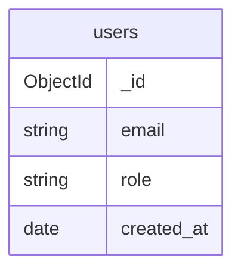

# 04. 데이터베이스 설계

> 문서 상태: ❓ 작성 전
> 규칙(1~2장)은 개발 전 확정, 구조도·정의서(3~4장)는 산출물로 개발하며 갱신한다.
> 아래는 MongoDB 기본값 기준이다. 업무정의서가 RDB를 지정하면 용어(컬렉션→테이블)와 항목을 바꾼다.

## 1. 기본 규칙

### DBMS / 버전 🧩
- 상태: 🧩 기본값 (01 참조)
- 결정: MongoDB — 앱 리포가 DB 컨테이너를 소유하지 않고, 이미 떠 있는 별도 Docker 컨테이너에 접속
- 결정일:

### 접속 정보 📋
- 상태: ❓ 미결정
- 결정: `.env`의 `MONGODB_URI`, `MONGODB_DBNAME` (예: `mongodb://host.docker.internal:27017`, `<project>_dev`). 실제 값은 문서에 쓰지 않는다
- 결정일:

### DB 분리 🧩
- 상태: 🧩 기본값
- 결정: 개발 `<project>_dev` / E2E 검증 `<project>_test` / 운영 `<project>` — 검증이 개발 데이터를 오염시키지 않게 분리
- 결정일:

### ORM / 데이터 접근 방식 💬
- 상태: ❓ 미결정
- 선택지 예: 공식 드라이버 / Mongoose / Prisma / Beanie(Motor) / Spring Data
- 결정:
- 결정일:

### 마이그레이션 / 인덱스 관리 💬
- 상태: ❓ 미결정
- 결정: (앱 기동 시 인덱스 보장 / 마이그레이션 스크립트 등. 도입 시 이 파일들이 스키마 원본이 된다)
- 결정일:

## 2. 네이밍 및 공통 규칙

### 네이밍 규칙 🧩
- 상태: 🧩 기본값
- 결정: 컬렉션 snake_case 복수형, 필드 snake_case (09 참조)
- 결정일:

### 공통 필드 🧩
- 상태: 🧩 기본값
- 결정: 모든 컬렉션에 `created_at`, `updated_at` (UTC 저장, 표시는 KST 변환)
- 결정일:

### ID 전략 🧩
- 상태: 🧩 기본값
- 결정: 기본 `_id`(ObjectId). 외부 노출용 식별자가 필요하면 별도 필드
- 결정일:

### 개인정보 처리 📋 💬
- 상태: ❓ 미결정
- 결정: (수집 항목·보존 기간·삭제 방식. 없으면 ➖)
- 결정일:

### 테스트 데이터 🧩
- 상태: 🧩 기본값
- 결정: 검증용 시드 데이터는 스크립트로 생성(`scripts/seed_*`). 실제 고객 데이터를 검증에 쓰지 않는다
- 결정일:

## 3. 컬렉션 구조도 (산출물 — 개발하며 갱신)

## 4. 컬렉션 정의서 (산출물 — 개발하며 갱신)

### 컬렉션 목록

| 컬렉션 | 설명 | 소유 모듈 | 상태 |
|---|---|---|---|
|  |  |  | 📝 |

### 컬렉션 상세 템플릿

| 필드명 | 타입 | 필수 | 기본값 | 인덱스 | 설명 |
|---|---|---|---|---|---|
| _id | ObjectId | YES | 자동 | PK | |
| created_at | Date | YES | now | | 생성일시 |
| updated_at | Date | YES | now | | 수정일시 |
