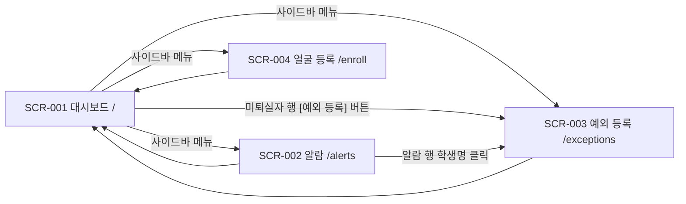

# 11. 화면 설계서

> 문서 상태: 산출물 문서 (개발하며 갱신)
> **규칙**: 새 화면을 구현하기 전에 반드시 여기에 설계를 먼저 작성하고 사용자 확인을 받은 후 구현한다.
> 대상: 행정실 데스크톱 전용 (03 — 최신 Chrome·Edge, 라이트/다크 지원). 와이어프레임 이미지: `wireframes/`

## 1. 화면 목록

> 상태: 📝 설계 / 🔄 개발중 / ✅ 완료 / 🗑 폐기

| ID | 화면명 | 경로(URL) | 접근 권한 | 상태 |
|---|---|---|---|---|
| SCR-001 | 출결 현황 대시보드 | `/` | 인증 없음 (내부망 전제 — 02) | 📝 |
| SCR-002 | 미태그 포착 알람 | `/alerts` | 인증 없음 | 📝 |
| SCR-003 | 예외 처리 등록 | `/exceptions` | 인증 없음 | 📝 |
| SCR-004 | 얼굴 등록 (가이드 촬영) | `/enroll` | 인증 없음 | ✅ |

## 2. 화면 흐름도



- 4화면 모두 공통 레이아웃(사이드바 + 헤더) 사용 — `components/layout/` (03 폴더 구조)
- 헤더의 퇴실 감시 상태·카메라 상태는 전 화면 공통 표시

## 3. 화면 상세 설계

---

### SCR-001. 출결 현황 대시보드

- **경로**: `/`
- **목적**: 행정실 직원이 모니터를 상시 띄워두고 당일 출결 현황·미퇴실자·실시간 포착 이벤트를 한눈에 감시한다 (유저 스토리 ①②)
- **진입 경로**: 기본 진입 화면
- **접근 권한**: 인증 없음 (내부망 전제)
- **상태**: 📝 설계

#### 와이어프레임

> 이미지: [wireframes/scr_001_dashboard.svg](wireframes/scr_001_dashboard.svg)

```
┌────────┬──────────────────────────────────────────────────┐
│        │ 헤더: 날짜·시각 | 퇴실감시 ON/OFF | 카메라 ●● | 테마  │
│ 사이드바 ├──────────────────────────────────────────────────┤
│ ─────── │ [당일 입실 32] [미퇴실 5] [퇴실 완료 27] [문자 2]   │
│ 대시보드 │ 강의별: (AI솔루션 18/20)(자바 10/18)… 클릭=필터    │
│ 알람    ├───────────────────────────┬──────────────────────┤
│ 예외등록 │  라이브 뷰: 주 화면+썸네일   │  실시간 이벤트 피드     │
│        │  (가로 스크롤·카메라 수 무관) │  (WebSocket 수신)     │
│        ├───────────────────────────┴──────────────────────┤
│        │  미퇴실자 테이블: 이름|강의명|입실|경과|예외|[예외 등록]│
└────────┴──────────────────────────────────────────────────┘
```

#### 구성 요소

| 요소 | 종류 | 동작 / 규칙 |
|---|---|---|
| 요약 카드 ×4 | 카드 | 당일 입실·미퇴실(잔존)·퇴실 완료·문자 발송 수. WebSocket 이벤트 수신 시 즉시 갱신 |
| 강의별 출석 칩 | 칩(가변) | 강의별 **입실 N / 정원 M**(`checked_in_count`/`capacity`). 칩 클릭 시 미퇴실자 테이블을 해당 강의로 필터, 재클릭 시 해제. 강의 수만큼 가변 렌더링 |
| 퇴실 감시 상태 뱃지 | 뱃지 | 퇴실 시간대 여부 (감시 중=강조색). 카메라 상태 점은 API-001 폴링(5초, 카메라 수만큼 가변) |
| 라이브 뷰 | 영상 | **주 화면(위) + 가로 스크롤 썸네일 목록(아래)** — 썸네일 고정 크기라 카메라 수와 무관하게 화면비 동일(4:3 `contain`). `` (API-002). 미연결 카메라는 회색 placeholder + 재연결 안내. 1대면 목록 숨김 (PR #164) |
| 실시간 이벤트 피드 | 목록 | WebSocket(API-008) 수신 이벤트 시간순 표시 — 포착·문자 발송·퇴실 태그. 최대 50건 유지 |
| 미퇴실자 테이블 | 테이블 | 이름·강의명·입실 시각·경과 시간·예외 여부. 행 버튼 [예외 등록] → SCR-003 이동(학생 프리필). 데이터=daily_roster 잔존자, 강의별 칩과 필터 연동 |

#### 연결 API

| 시점 | API ID | 용도 |
|---|---|---|
| 진입 시 | API-003 | 당일 출결 요약·강의별 집계 + 미퇴실자 목록(`course_name` 포함) |
| 진입 시 | API-001 | 카메라 상태 (이후 5초 폴링) |
| 진입 시 | API-002 | 라이브 뷰 (카메라 수만큼, 주 화면 + 썸네일) |
| 상시 | API-008 | WebSocket 실시간 이벤트 → TanStack Query 캐시 무효화/갱신 |

#### 상태별 화면
- **로딩 중**: 카드·테이블 스켈레톤
- **데이터 없음**: "당일 입실 데이터가 없습니다 (LMS 명단 수신 전)" 안내
- **에러**: 카드 영역 상단 배너 "서버 연결 실패 — 재시도 중" + 자동 재시도. WebSocket 끊김 시 헤더에 ⚠ 표시(재연결 로직 — 03)

#### 비고
- 개인정보: 이 화면은 행정실 전용 모니터 전제. 연락처는 표시하지 않음 (이름만)
- 라이브 뷰는 시청 제한(카메라당 3커넥션)이 있어 대시보드 1대 상시 + 여분 2 구조
- 강의명은 LMS 출결 API의 `courseName`을 경계면 규칙(rules/09)에 따라 `course_name`으로 저장·전달. 강의별 칩은 **입실 N / 정원 M** — 결석자만큼 차이 나는 것이 정상이므로 이 차이는 경고가 아니다. 수집 이상 감지는 BAT-001이 LMS 응답 자체(`total` ↔ `attendees.length`)로 검증해 상단 배너로 알린다 (specs/12)

---

### SCR-002. 미태그 포착 알람

- **경로**: `/alerts`
- **목적**: 퇴실 미체크 상태로 카메라에 포착된 이력을 확인하고 문자 발송 결과를 추적한다 (유저 스토리 ③)
- **진입 경로**: 사이드바 메뉴 / 대시보드 이벤트 피드 항목 클릭
- **접근 권한**: 인증 없음
- **상태**: 📝 설계

#### 와이어프레임

> 이미지: [wireframes/scr_002_alerts.svg](wireframes/scr_002_alerts.svg)

```
┌────────┬──────────────────────────────────────────────────┐
│ 사이드바 │ 필터: [날짜▾] [카메라▾] [발송상태▾]      [검색____]  │
│        ├──────────────────────────────────────────────────┤
│        │ 알람 테이블: 포착시각|카메라|식별결과|유사도|발송상태    │
│        │  ...행 클릭 → 우측 상세 패널 (메타데이터)              │
│        ├──────────────────────────────────────────────────┤
│        │                            ◀ 1 2 3 ▶ (페이지네이션) │
└────────┴──────────────────────────────────────────────────┘
```

#### 구성 요소

| 요소 | 종류 | 동작 / 규칙 |
|---|---|---|
| 필터 바 | 폼 | 날짜(기본 오늘)·카메라·발송 상태(발송/실패/대상아님). 변경 시 목록 재조회 |
| 알람 테이블 | 테이블 | 포착 시각·카메라·식별 결과(이름 또는 "미매칭")·유사도(%)·문자 발송 상태 뱃지. 신규 알람은 WebSocket으로 최상단 삽입 + 하이라이트 |
| 상세 패널 | 패널 | 행 클릭 시 우측 슬라이드 — 탐지 메타데이터(camera_id·bbox·유사도·판정 근거·발송 이력). **스냅샷 이미지는 없음 — 프레임 미저장 정책(specs/10 API-002 비고)** |
| 학생명 링크 | 링크 | 클릭 → SCR-003 이동 (해당 학생 프리필) |

#### 연결 API

| 시점 | API ID | 용도 |
|---|---|---|
| 진입/필터 변경 시 | API-004 | 알람 목록 조회 (페이징) |
| 상시 | API-008 | 신규 포착 이벤트 실시간 삽입 |

#### 상태별 화면
- **로딩 중**: 테이블 스켈레톤
- **데이터 없음**: "포착된 알람이 없습니다" (정상 상황 — 긍정 톤)
- **에러**: 배너 + 재시도 버튼

#### 비고
- 유사도는 소수점 1자리 % 표시. 임계값 미만 "미매칭" 건도 회색으로 목록에 남김 (판정 투명성 — 05 안전장치)

---

### SCR-003. 예외 처리 등록

- **경로**: `/exceptions`
- **목적**: 외출·조퇴·병결·오전반/오후반 예외를 등록해 미퇴실 판정·문자 발송 대상에서 제외한다 (유저 스토리 ⑤)
- **진입 경로**: 사이드바 / SCR-001 미퇴실자 행 [예외 등록] / SCR-002 학생명 클릭 (모두 학생 프리필로 진입 가능)
- **접근 권한**: 인증 없음
- **상태**: 📝 설계

#### 와이어프레임

> 이미지: [wireframes/scr_003_exceptions.svg](wireframes/scr_003_exceptions.svg)

```
┌────────┬───────────────────┬──────────────────────────────┐
│ 사이드바 │ 등록 폼            │ 당일 예외 목록                 │
│        │ 학생 [검색▾]       │ 테이블: 학생|유형|시간|사유|[삭제] │
│        │ 유형 (외출/조퇴/    │                              │
│        │  병결/오전반/오후반) │                              │
│        │ 시간 [__:__~__:__] │                              │
│        │ 사유 [_________]   │                              │
│        │      [ 등록 ]      │                              │
└────────┴───────────────────┴──────────────────────────────┘
```

#### 구성 요소

| 요소 | 종류 | 동작 / 규칙 |
|---|---|---|
| 학생 선택 | 검색 셀렉트 | **API-010**으로 당일 수강생 전원 검색 (미출석자 포함 — 병결 등록 대상). 미출석자는 회색 + "미출석" 표시로 구분. 프리필 진입 시 자동 선택 |
| 유형 선택 | 세그먼트 버튼 | 외출 / 조퇴 / 병결 / 오전반 / 오후반 (단일 선택, 필수) |
| 시간 범위 | 타임 입력 | 외출만 종료 시각 필수, 조퇴·병결은 시작 시각만. 유형에 따라 입력란 활성/비활성 |
| 사유 | 텍스트 | 선택 입력, 100자 제한 |
| [등록] 버튼 | 버튼 | API-005 호출 → 성공 토스트 + 목록 갱신 + 폼 초기화. 등록 즉시 판정·문자 제외 반영 |
| 당일 예외 목록 | 테이블 | 학생·유형·시간·사유·등록 시각. [삭제] 클릭 → 확인 다이얼로그 → API-007 |

#### 연결 API

| 시점 | API ID | 용도 |
|---|---|---|
| 진입/검색 시 | API-010 | 당일 수강생 검색 (미출석자 포함 — LMS 실시간, 미저장) |
| 진입 시 | API-006 | 당일 예외 목록 |
| [등록] 클릭 | API-005 | 예외 등록 |
| [삭제] 클릭 | API-007 | 예외 삭제 (확인 다이얼로그 필수 — 되돌리면 판정 대상 복귀) |

#### 상태별 화면
- **로딩 중**: 폼 비활성 + 스피너
- **데이터 없음**: 목록 "등록된 예외가 없습니다"
- **에러**: 등록 실패 시 폼 하단 인라인 에러 (검증 실패 필드 강조 — Bean Validation 메시지 매핑)

#### 비고
- 검증: 학생·유형 필수. 동일 학생+동일 유형 중복 등록 시 409 안내
- 예외 등록/삭제는 판정 결과에 직접 영향 → 07 필수 테스트 대상과 연동됨을 주석으로 명시

---

### SCR-004. 얼굴 등록 (가이드 촬영)

- **경로**: `/enroll`
- **목적**: 신규 수강생의 얼굴을 5방향(정면·좌·우·상·하)으로 가이드 촬영해 식별용 임베딩을 `registered_faces`에 등록(학습)한다. 등록된 얼굴이 있어야 퇴실 시간대 카메라 포착 시 본인 식별이 가능하다 (유저 스토리 ②③의 선행 조건)
- **진입 경로**: 사이드바 메뉴 `얼굴 등록`
- **접근 권한**: 인증 없음 (내부망 전제 — 행정실 데스크톱)
- **상태**: ✅ 완료 (2026-08-12 — `pages/EnrollPage.tsx` + `features/enroll/`, API-016·017)

#### 와이어프레임

> 이미지: [wireframes/scr_004_face_enroll.svg](wireframes/scr_004_face_enroll.svg)

```
┌────────┬──────────────┬─────────────────────┬──────────────┐
│ 사이드바 │ 미등록자 목록  │ 촬영 가이드           │ 5방향 진행     │
│ ─────── │ [미등록 6]    │ ┌─────────────────┐ │ ✓ 정면        │
│ 대시보드 │ 홍OO ▸선택됨  │ │ (카메라)          │ │ ✓ 좌측        │
│ 알람    │ 강OO         │ │  ◯ 얼굴 가이드 →  │ │ ● 우측 촬영중  │
│ 예외등록 │ 문OO         │ │                  │ │ ○ 상단        │
│ 얼굴등록 │ 백OO …       │ └─────────────────┘ │ ○ 하단        │
│  ▣     │ =명단∖등록    │ 경계/밝기/정면성 OK   │ [ 등록 완료 ] │
└────────┴──────────────┴─────────────────────┴──────────────┘
```

#### 구성 요소

| 요소 | 종류 | 동작 / 규칙 |
|---|---|---|
| 미등록자 목록 | 목록(선택) | **얼굴이 아직 없는 신규 수강생** = 당일 LMS 명단 ∖ `registered_faces`. 상단 "미등록 N" 탭 + 이름·과정 검색. **행 클릭 = 등록 대상 선택**(우측 촬영 대상이 됨). 등록 완료 시 목록에서 사라짐 → 남은 대상만 표시. 미출석자도 명단에 있으면 포함(등록은 출석과 무관) |
| 등록됨 목록 | 목록(탭) | **"등록 N" 탭** — 누가 이미 등록됐는지(임베딩 개수·**세션 횟수**·만료일) 보여준다. 이 탭이 없으면 행정실이 "김OO 등록했던가?"에 답할 방법이 없다. 행마다 **[추가 촬영]**(기존에 더한다 — 세션 2개 만들기)·**[재촬영]**(덮어쓰기)·**[삭제]**(API-018, 확인 창). 세션이 1회면 "다른 날 [추가 촬영] 1회 권장"을 띄운다 |
| 촬영 가이드 | 영상+오버레이 | 카메라 위에 얼굴 가이드 타원 + 다음 방향 화살표 + 진행 호. 현재 단계 뱃지("3/5·우측"). 미리보기는 거울처럼 좌우 반전하고 **서버로 보내는 프레임은 반전하지 않는다**(반전된 얼굴을 등록하면 CCTV와 좌우가 어긋난다) |
| 품질 상태 바 | 상태 | 거리·중심·밝기·흔들림 실시간 검증. **통과 프레임에서만 임베딩 추출**(바운더리 검증 — 05_AI). [지금 촬영] 버튼은 자세 판정이 안 넘어갈 때의 탈출구이며 품질 게이트는 그대로 지킨다 |
| 5방향 진행 | 체크리스트 | 정면·좌·우·상·하 각 단계 완료/진행중/대기 표시. **방향당 6장 = 인당 임베딩 30개**(2026-08-12 CTO 지정 — 05_AI 실측 권장은 5~10장이라 그 위이며, 재측정 대상). 한 각도만 등록하면 교차 세션 유사도가 붕괴(0.93→0.31)하므로 5방향 분산 필수 (05_AI) |
| [등록 완료] 버튼 | 버튼 | **5방향 모두 촬영해야 활성화**. 클릭 → 임베딩 저장 + 등록부 반영(API-012 리로드) |

#### 연결 API

> ✅ 2026-08-12 확정·구현. **미등록자 대조는 화면이 한다** — 명단은 Spring, 등록부는 FastAPI로 소유가 갈리므로(rules/04) 서버끼리 대신 조회하지 않는다. LMS가 죽어도 학번·이름 직접 입력으로 등록할 수 있는 경로가 이 선택에서 나온다.

| 시점 | API ID | 용도 | 소유 |
|---|---|---|---|
| 진입 시 | API-010 | 당일 수강생 전원 (미출석자 포함) | Spring(:8080) |
| 진입 시 | API-016 | 등록 완료 학생 목록 → 화면이 명단에서 뺀다 | FastAPI(:8000) |
| [촬영 시작] | API-017 | 세션 생성 (동의 확인 필수) | FastAPI(:8000) |
| 촬영 중 | API-017b | 초당 6~7장 프레임 판정 (자세·품질·진행률) | FastAPI(:8000) |
| [등록 완료] | API-017c | 임베딩 저장 + 등록부 리로드(API-012 통합) | FastAPI(:8000) |
| 화면 이탈·취소 | API-017d | 세션 폐기 — 확정 전 임베딩을 남기지 않는다 | FastAPI(:8000) |
| [삭제] | API-018 | 등록 얼굴 삭제 + 등록부 리로드 — 동의 철회·오등록·중도 퇴원 | FastAPI(:8000) |

#### 상태별 화면
- **로딩 중**: 카메라 대기 오버레이 (대상을 고르기 전에는 카메라를 켜지 않는다 — 램프가 계속 켜져 있으면 그 자체가 신뢰 문제다)
- **미등록자 없음**: "등록할 신규 수강생이 없습니다 (전원 등록 완료)" — 긍정 톤
- **품질 미달**: "조금 더 가까이 와주세요" 등 **서버가 준 문구 그대로**. 자세 판정 이전에 막히고 임베딩도 추출하지 않는다
- **카메라 미연결/거부**: 원인별로 다른 안내 — 권한 거부(자물쇠 아이콘 경로)·장치 없음·다른 앱이 점유 중. "찾을 수 없습니다"로 뭉치면 고칠 수가 없다
- **명단 조회 실패**: 학번·이름 직접 입력 폼으로 대체 (등록은 LMS에 의존하지 않는다)
- **비보안 접속(`http://<IP>`)**: 카메라가 원천 차단되므로 그 사실과 해결책(그 PC의 localhost·HTTPS)을 먼저 띄운다
- **에러**: 저장 실패 시 안내 + 재시도 (세션이 서버에 남아 있어 촬영본을 잃지 않는다)

#### 비고
- **개인정보(04)**: 기본은 **임베딩(특징 벡터)만 저장**이고, 아래 [사진도 함께 보관]을 켠 세션만 크롭을 남긴다. 동의자만 등록 — 화면의 동의 체크박스를 켜야 촬영이 시작되고, 서버도 `consent` 없이는 세션을 만들지 않는다. 남긴 사진은 임베딩과 **같은 수명**이다(삭제·만료 시 함께 파기 — rules/04)
- **[사진도 함께 보관] 체크박스** (2026-08-13 추가): 켜면 임베딩과 함께 대상자 크롭도 남긴다. **임베딩은 모델에 종속**이라 앙상블 전환 시 전부 무효가 되는데, 사진이 없으면 학생을 다시 불러 재촬영해야 한다 — 켜 두면 `tools/backfill_ensemble_gallery.py`로 임베딩만 다시 뽑으면 된다. 기본은 꺼짐이고, 체크 상태는 **대상을 바꿔도 유지**된다(여러 명을 연달아 등록하는 작업이라 매번 체크하게 하면 빠뜨린다)
  - 보관한 사진도 등록 임베딩과 **같은 수명**이다 — 삭제(API-018)는 사진까지 함께 파기한다 (rules/04)
- ⚠ **학생명은 익명 표기하지 않고 그대로 보여준다** (설계안에서 변경, 2026-08-12). 등록은 *사람을 지목해 찍는* 행위라 동명이인을 구분하지 못하면 **다른 사람 얼굴이 그 학번에 붙는다**. 같은 데스크의 SCR-003도 실명을 그대로 쓰고 있어 표기 규칙이 갈리면 혼란만 는다. 익명 표기는 문서·와이어프레임의 규칙으로 남긴다
- **보존기간**: `registered_faces`도 LMS period 만료 대상 = 과정 종료일+1일 (rules/04). 과정 종료 시 등록 얼굴도 함께 파기
- 모델: 등록 임베딩은 **탐지가 쓰는 그 엔진**(`FaceEngine`)으로 뽑는다 — 등록과 조회가 다른 모델이면 유사도 자체가 의미를 잃는다. 2026-08-13부터 **앙상블 원트랙**(ArcFace-R100 + AdaFace-ir101)이고 등록도 실시간으로 두 임베딩을 뽑는다
  - 성능(컨테이너 실측): 탐지 **9.4ms**/프레임, 앙상블 임베딩 **167ms**/얼굴. 임베딩은 매 프레임이 아니라 **촬영 순간에만** 돌고 촬영 간격이 0.45초라 여유가 있다. ⚠ SFace(6.4ms) 대비 26배라 촬영되는 프레임 하나는 눈에 띄게 늦게 응답한다 — 화면의 inFlight 가드가 있어 요청이 쌓이지는 않는다
  - **모델을 바꿔도 재촬영은 필요 없다** — 사진을 보관해 두면 `tools/backfill_ensemble_gallery.py`가 그 사진에서 새 임베딩을 뽑아 채운다. 그래서 **[사진도 함께 보관]을 켜고 찍는 것이 사실상 기본**이다 (rules/04 "앙상블 갤러리")
- **판정 로직은 CLI 도구와 한 벌**(`webapp/app/services/enroll.py`) — 임계값·부호·중립 보정은 실기기에서 고쳐 온 값이라 복제하면 갈라진다 (rules/05 "웹 화면 연결")
- ⚠ **카메라는 `https`/`localhost`에서만 열린다** — `http://<서버IP>:8090`으로 접속하면 브라우저가 막는다. 학원 데스크에서는 그 PC의 `localhost`로 열거나 HTTPS를 붙일 것 (rules/06)
- **만료를 그 학생 과정에 맞추려면 과정명이 필요하다** (2026-08-12 실측): `daily_roster`는 퇴실하면 지워지므로 **저녁에 등록하면 강의를 못 찾고** 만료가 "그날 가장 짧은 과정"으로 떨어진다 — 과정이 내년까지인 학생의 얼굴이 이틀 뒤 파기될 상황이었다. 그래서 화면이 명단에서 받은 **과정명을 세션 시작 시 함께 보낸다**. 직접 입력 경로에는 과정명이 없어 폴백을 타므로, 등록됨 탭에 **"⚠ 과정 미상"**을 표시해 눈에 띄게 한다
- CTO 담당 얼굴 탐지 프로그래밍(3번 트랙)과 연결되는 프론트 화면 — 탐지가 참조하는 등록부를 이 화면이 채운다
