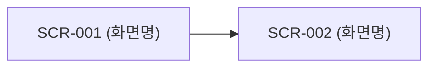

# 11. 화면 설계서

> 문서 상태: 산출물 문서 (개발하며 갱신)
> **규칙**: 새 화면을 구현하기 전에 반드시 여기에 설계를 먼저 작성하고 구현한다.
> 대상 디바이스·브라우저는 `rules/03` 6장, UI 태그 형식은 `rules/03` 4장을 따른다. 와이어프레임 이미지: `wireframes/`

## 1. 화면 목록

> 상태: 📝 설계 / 🔄 개발중 / ✅ 완료 / 🗑 폐기
> 업무정의서 흡수(AGENT_GUIDE Phase 1) 시 화면별로 📝 행을 먼저 등록한다. `태그 영역`은 UI 태그 접두어(3자).

| ID | 화면명 | 경로(URL) | 접근 권한 | 태그 영역 | 상태 |
|---|---|---|---|---|---|
| SCR-000 | 공통 레이아웃 (헤더·메뉴·푸터) | - | - | COM | 📝 |

## 2. 화면 흐름도



## 3. UI 태그 대장

> 새 `data-ui-id`는 여기에 먼저 등록한다. 프로젝트 전체 유니크. 의뢰자 피드백은 이 번호로 받는다.

| UI ID | 화면 | 요소 설명 | 연결 동작 / API |
|---|---|---|---|
| COM-LNK-HOME | SCR-000 | 로고 → 홈 이동 | - |

## 4. 화면 상세 설계

### 템플릿 (새 화면 추가 시 복사)

### SCR-XXX. (화면명)

- **경로**: `/...`
- **목적**: (어떤 유저 스토리를 위한 화면인지 — rules/00)
- **진입 경로**:
- **접근 권한**:
- **상태**: 📝 설계

#### 와이어프레임

```
┌──────────────────────────────────────┐
│ 헤더                                  │
├──────────────────────────────────────┤
│                                      │
└──────────────────────────────────────┘
```

#### 구성 요소

| UI ID | 요소 | 종류 | 동작 / 규칙 |
|---|---|---|---|
|  |  |  |  |

#### 연결 API

| 시점 | API ID | 용도 |
|---|---|---|
| 진입 시 |  |  |

#### 상태별 화면
- **로딩 중**:
- **데이터 없음**:
- **에러**:

#### E2E 검증 시나리오 (rules/07)
1. (사용자 동작 → 기대 결과)

#### 비고
-
